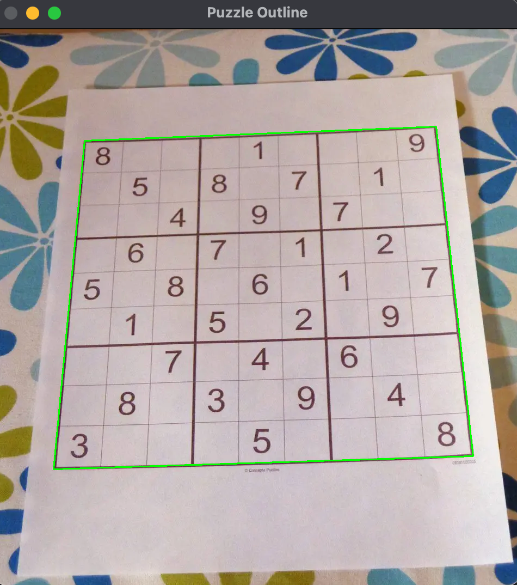

### Preprocessing

The initial preprocessing steps involve cleaning up the image and preparing it for analysis.

---

### Adaptive Median Filtering

Adaptive median filtering is applied to remove noise while preserving edges.

---

### Gaussian Blur and Adaptive Thresholding

To enhance contrast, Gaussian blur is combined with adaptive thresholding.

---

### Contouring and 4-Point Transform

Contours are detected, and a 4-point perspective transform is applied to isolate the region of interest.

---

### Cell Extraction and Digit Masking

#### Number 8 - Cell and Mask

#### Number 1 - Cell and Mask

#### Empty Cell - No Mask Generated
This step shows how empty cells are identified with no mask generated.

---

### Optical Character Recognition (OCR)

OCR is used to recognize digits or characters from each extracted cell.

---

### Output Superimposed (Image Write)

The recognized digits are superimposed onto the original image as an output, showing the results of the entire pipeline.

